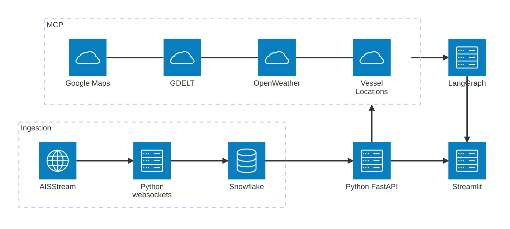
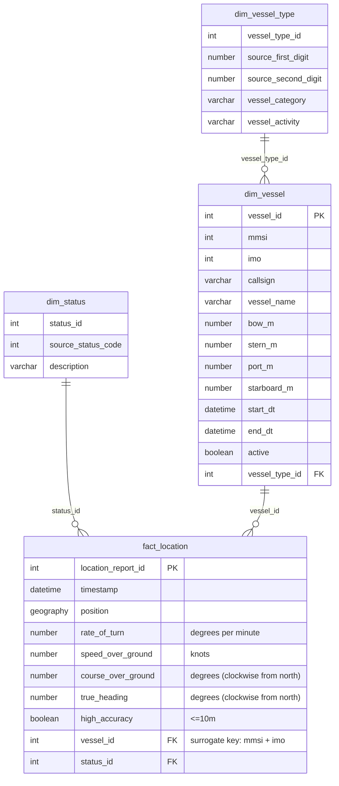

# AIS Vessel Tracking

## Problem Statement

Currently, publicly available vessel tracking data is unwieldy and difficult to get insights from. Available options include:
1. Joining the AIS network (requires purchase/operation of expensive equipment)
2. Filing Freedom-of-Information-Act requests with the US Coast Guard
3. Streaming raw data from a WebSocket (not user-friendly or useful for analytics)

However, this data has a lot of valuable applications, including logistics, early market warnings, and national security.

To that end, we aim to create a big-data pipeline that reads the available AIS feed into a data warehouse. We will design an API layer that provides useful methods for accessing the data. Finally, we will provide a sample application for the data, including sophisticated agent for answering questions using the APIs we create + additional third-party integrations.

## System Architecture

## Data Sources

| Source | What Data? | How to Access? | Why We Need It? | What It Returns? | Limitations |
|--------|-----------|----------------|-----------------|------------------|-------------|
| **[AISStream](https://aisstream.io)** (Real-time stream, Free, API key required) | Ship positions, speed, heading, identity, type, dimensions — broadcast by every commercial vessel globally | WebSocket connection using Python `websockets` library. Data is ingested into Snowflake via Snowpipes. Served to users through FastAPI endpoints. | Core data source. Answers "where are ships?" and "how are they moving?" Feeds the dimensional model that everything else builds on. | MMSI, IMO, ship name, lat/lon, speed, course, heading, rate of turn, nav status, ship type, dimensions. ~6,000 messages/min globally. | No cargo info. Ships can go dark. GPS spoofing possible. Open ocean coverage gaps. Websocket disconnects lose data. |
| **[GDELT](https://blog.gdeltproject.org/gdelt-geo-2-0-api-debuts/)** (On-demand API, Free, No key needed) | Global news articles — titles, sources, dates, countries, tone scores, locations. Monitors 100+ languages, updates every 15 minutes. | REST API or Python `gdeltdoc` library. Pass keyword + date range, get back matching articles. No authentication needed. | Provides the "why." If AIS shows traffic dropped, GDELT explains the cause — conflict, sanctions, port strike, disaster. | URL, title, date, domain, language, source country, tone. Up to 250 articles per query. Covers last 3 months (DOC API) or 7 days (GEO API). | English-language bias. Noisy results. Geocoding errors in article tagging. 15-min delay. Rate limiting. |
| **[OpenWeatherMap](https://openweathermap.org/api)** (On-demand API, Free tier, API key required) | Weather conditions at any lat/lon — temperature, wind, humidity, visibility, pressure, cloud cover, weather description. | REST API with API key. Pass lat + lon, get JSON back. Free tier: 1,000 calls/day on v2.5. | Verification layer. Confirms or rules out weather as the cause of shipping anomalies. Prevents the agent from blaming a conflict when it was actually a typhoon. | Temperature (°C), feels_like, humidity (%), wind_speed (m/s), wind_deg, visibility (m), pressure (hPa), weather description. | Point data only. Free v2.5 = current weather only. Historical data needs paid plan. No wave height on free tier. |
| **[Google Maps](https://mapsplatform.google.com/maps-products/)** (On-demand API, $200 free/month, API key + billing required) | Geocoding — converts place names ("Strait of Hormuz") into lat/lon coordinates and bounding boxes. | REST API with API key. Pass place name, get coordinates. Requires Google Cloud project with billing. Alternative: Nominatim (free, no key). | The glue connecting everything. Users type place names, but AIS, GDELT, and OpenWeather need coordinates. Without geocoding, the agent can't translate questions into queries. | Formatted address, lat, lon, bounding box (NE + SW corners), location type. Bounding boxes are critical for AIS area queries. | Maritime terms may resolve poorly. Open ocean areas fail. Needs billing setup. Some ports return point instead of area. |

**How they connect:** Google Maps converts place names → coordinates. AIS uses coordinates → vessel traffic data. GDELT uses keywords → news context. OpenWeather uses coordinates → weather conditions. The LangGraph agent orchestrates all four to produce complete answers.

## Data Volume Estimates

Based on observed ingestion rate of ~100 messages/second from AISStream global feed and estimated agent usage of ~100 queries/day per external API.

| Source | Data Type | Per Day | 2 Weeks (Project) |
|--------|-----------|---------|---------------------|
| **AISStream** | Vessel position reports | ~8.6M messages (~6.5 GB raw, ~1.3 GB compressed) | ~120M messages (~90 GB raw, ~18 GB compressed) |
| **AISStream** | Unique vessels tracked | ~10,000–15,000 | ~60,000+ |
| **AISStream** | Rows in fact_location | ~6–7 million | ~90 million |
| **GDELT** | News articles retrieved | ~25,000 articles (~25 MB) | ~350,000 articles (~350 MB) |
| **OpenWeather** | Weather lookups | ~100 responses (~300 KB) | ~1,400 responses (~4 MB) |
| **Google Maps** | Geocoding lookups | ~100 responses (~200 KB) | ~1,400 responses (~3 MB) |
| **Total** | All sources combined | ~6.5 GB raw / ~1.3 GB stored | ~90 GB raw / ~18.4 GB stored |

> **Note:** AIS is the dominant data source by volume. GDELT, OpenWeather, and Google Maps are small in size but critical for intelligence value — they provide the context that makes raw vessel data meaningful. If AIS ingestion is filtered to key maritime chokepoints, total volumes reduce to ~10–15% of the above.

## Components

### AIS Tracker
1. Data ingested via websocket from [AISStream](https://aisstream.io)
2. Data is parsed and cleaned, then passed into raw tables
3. Data from raw tables is loaded to dimensional model using Snowpipes
4. Data in Snowflake is provided to end applications via FastAPI

#### Dimensional model

#### API endpoints

- **/vessels**
    - List all vessels, filtering by vessel characteristics or time/place spotted
- **/vessels/{mmsi}**
    - Get details for a specific vessel using its MMSI (source key)
- **/vessels/{mmsi}/logs**
    - Get list of all position reports published by a vessel in a specified timeframe
    - Can be used for trajectory analysis or plotting

### MCP Server

Wraps services:
- AIS Tracker (above)
- [OpenWeatherMap](https://openweathermap.org/api/one-call-3?collection=one_call_api_3.0)
    - Allows querying weather at a specific location at a specific time.
- [GDELT](https://blog.gdeltproject.org/gdelt-geo-2-0-api-debuts/)
    - Provides powerful querying of international news sources to find events by location/time/keyword.
- [Google Maps APIs](https://mapsplatform.google.com/maps-products/)
    - Allows resolution of natural-language place names to geographic coordinates

These are provided for use in agentic workflows to answer questions such as:

> How has the Iran conflict affected traffic around the Strait of Hormuz?

> How does the number of ships harbored in Sydney Harbor compare to 2 years ago?

> How long did it take ship 219032032 to pass through the Panama Canal on Wednesday?

### Streamlit

TBD

### Work distribution

- Seamus - Ingestion pipeline & FastAPI backend
- Deep -
- Tapan -
