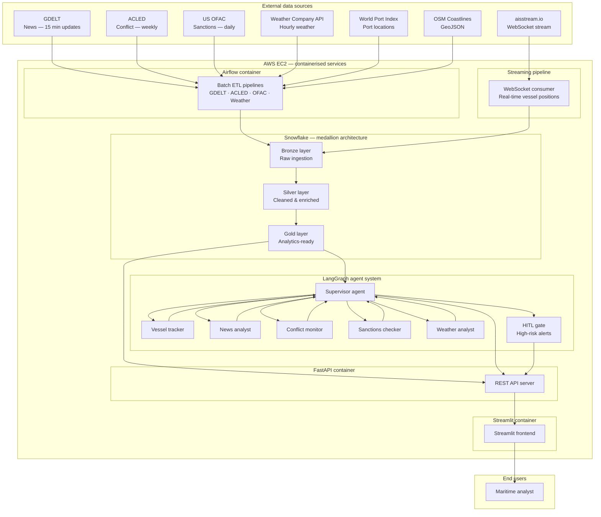
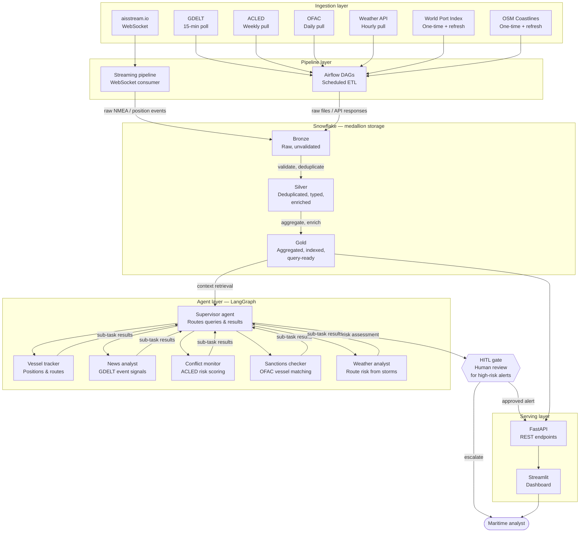

# Final Project Proposal
**DAMG 7245 — Big Data and Intelligent Analytics**

## Team Members
- Deep Patel
- Tapan Patel
- Seamus McAvoy

### Attestation (Required)
WE ATTEST THAT WE HAVEN'T USED ANY OTHER STUDENTS' WORK IN OUR ASSIGNMENT AND ABIDE BY THE POLICIES LISTED IN THE STUDENT HANDBOOK.

## 1. Title
**Maritime AI Sentinel:** Global Maritime Supply Chain Resilience via Geopolitical Event Tracking and Agentic AI

## 2. Introduction

### 2.1 Background
Global maritime shipping carries over 80% of international trade by
volume (UNCTAD Review of Maritime Transport 2024). The industry faces an
unprecedented convergence of disruptions: geopolitical conflicts
redirecting shipping routes (Red Sea / Houthi attacks adding 10--14 days
to Asia--Europe voyages), climate events blocking critical chokepoints
(Panama Canal drought 2023--24 cutting daily transits from 36 to 24),
and evolving sanctions regimes requiring real-time compliance screening.
These events cascade through global supply chains, causing port
congestion, container shortages, freight rate volatility, and billions
in delayed goods.

Today, maritime intelligence is fragmented. Vessel tracking data (AIS)
sits in one silo, geopolitical event feeds in another, sanctions lists
in a third, as well as weather/other misc. sources. Analysts at logistics
firms, insurers, and commodity traders must manually cross-reference
these sources to assess risk---a process that is slow, error-prone, and
fundamentally unscalable. No single platform provides an integrated,
AI-driven view that continuously monitors geopolitical events,
correlates them with live vessel movements, and proactively recommends
supply chain adjustments.

This project addresses that gap by building Maritime AI Sentinel---a
cloud-native, agentic AI platform that ingests high volumes of
heterogeneous maritime and geopolitical data, fuses them through
big-data pipelines, and deploys a LangGraph-based multi-agent system to
deliver real-time risk intelligence and actionable rerouting
recommendations.

### 2.2 Objective
The primary goals of this project are:

-   **Big Data Engineering:** Ingest, process, and store 50+ GB of
    multi-source maritime and geopolitical data in Snowflake using
    Airflow-orchestrated batch and near-real-time pipelines.

-   **Significant LLM Use:** Deploy a LangGraph multi-agent system with
    5+ specialist agents (geopolitical analyst, sanctions screener,
    route optimizer, risk scorer, briefing generator) using Claude and
    OpenAI models with RAG over vector-embedded evidence.

-   **Cloud-Native Architecture:** Fully containerized (Docker),
    orchestrated on GCP Cloud Run / Snowflake, with CI/CD via GitHub
    Actions and infrastructure-as-code.

-   **User-Facing Application:** Streamlit dashboard with interactive
    globe visualization, real-time alert feed, vessel search, risk
    heatmaps, and agentic chat interface for natural language supply
    chain queries.

## 3. Project Overview

### 3.1 Scope
- **Data Sources**
  - [aisstream.io](aisstream.io) - Real-time vessel locations streamed via websockets
  - [GDELT](https://www.gdeltproject.org) - Large open database of international news media
  - [ACLED](https://acleddata.com) - Conflict monitoring (weekly) & predictions of future conflict
  - [US OFAC](https://www.opensanctions.org/datasets/us_ofac_cons/) - Active sanctions data
  - [The Weather Company API](https://developer.weather.com/docs) - Global weather forecasts
  - [World Port Index](https://data.humdata.org/dataset/world-port-index) - Locations and characteristics of all ports worldwide
  - [OSM Coastlines](https://www.naturalearthdata.com/downloads/10m-physical-vectors/10m-coastline/) - GeoJSON map of coastlines

- **ETL pipelines**
  - Apache Airflow - Batch data processing based around GDELT and ACLED update schedules
    - GDELT - Updates every 15 minutes
    - ACLED - Weekly updates (Tuesday)
    - US OFAC - Maritime sanctions to be refreshed daily
    - Hourly weather updates (storms/extreme weather only)
  - Medallion architecture (bronze/silver/gold layers) in Snowflake
  - Websocket-based streaming pipeline for real-time vessel location & heading tracking

- **LLM components**
  - LangGraph supervisor agent orchestrating 5 specialist agents with human-in-the-loop (HITL) gates for high-risk alerts

- **Cloud infrastructure**
  - Containers hosted in AWS EC2:
    - Airflow
    - FastAPI server
    - Streamlit frontend

### 3.2 Stakeholders / End Users
- **Logistics / Freight Forwarders** - Monitor vessel ETAs & detect delays from geopolitical events, enabline proactive rerouting
- **Commodity traders** - Early warning on supply shocks

## 4. Problem Statement

### 4.1 Current Challenges
-   **Data Fragmentation:** AIS data (vessel positions), geopolitical
    event feeds (GDELT/ACLED), sanctions lists (OFAC/EU/UN), and trade
    statistics (UN Comtrade) exist in completely separate systems with
    incompatible schemas, temporal granularities, and geographic
    reference systems.

-   **Manual Workflows:** Maritime risk analysts spend 4--8 hours daily
    cross-referencing multiple dashboards (MarineTraffic, Reuters,
    Treasury.gov) to produce a single risk assessment. This is
    fundamentally unscalable during crisis escalation.

-   **Lack of Intelligent Automation:** Current tools provide data but
    no reasoning. No platform can answer: "If the Strait of Hormuz is
    blockaded, which of our vessels are at risk, what is the cost
    impact, and what are the best alternative routes?"

-   **Big Data Bottlenecks:** AIS data alone generates \~300M position
    reports daily globally. GDELT produces 2.5TB+ annually. Processing
    this at scale requires distributed compute that most maritime
    analysts lack access to.

-   **LLM Hallucination Risk:** Applying LLMs naively to high-stakes
    maritime decisions is dangerous. Hallucinated sanctions matches or
    false rerouting recommendations could cost millions or create legal
    liability.

### 4.2 Opportunities
-   **Scalable Pipelines:** Snowflake's elastic compute + Airflow
    orchestration enables processing of multi-TB maritime datasets with
    pay-per-use economics using our \$300 credit allocation.

-   **LLM-Assisted Analysis:** A LangGraph multi-agent system can
    decompose complex supply chain questions into sub-tasks (sanctions
    check, route analysis, risk scoring) handled by specialist
    agents---mimicking a team of human analysts at 100x speed.

-   **Automated Decision Support:** RAG-grounded agents with HITL gates
    enable confident, citation-backed rerouting advisories that humans
    can trust and approve.

-   **Near-Real-Time Insights:** Streaming AIS data + 15-minute GDELT
    updates + weekly ACLED refreshes provide a continuously updated risk
    picture.

## 5. Methodology

### 5.1 Data Sources
  - [aisstream.io](aisstream.io) - Real-time vessel locations streamed via websockets
    - <1GB impact - negligible history retained
  - [GDELT](https://www.gdeltproject.org) - Large open database of international news media
    - Events 2.0 database - 50MB daily * 30-day history = 1.5GB
    - DOC API to be accessed as-needed by agentic workflows
  - [ACLED](https://acleddata.com) - Conflict monitoring (weekly) & predictions of future conflict
    - 1 month of history = 20MB
  - [US OFAC](https://www.opensanctions.org/datasets/us_ofac_cons/) - Active sanctions data
    - Maritime-related sanctions = 5MB
  - [The Weather Company API](https://developer.weather.com/docs) - Global weather forecasts
    - All global severe weather alerts in past 30 days = 10MB
    - Update hourly
  - [World Port Index](https://data.humdata.org/dataset/world-port-index) - Locations and characteristics of all ports worldwide
    - 70MB (static)
  - [OSM Coastlines](https://www.naturalearthdata.com/downloads/10m-physical-vectors/10m-coastline/) - GeoJSON map of coastlines
    - 10MB (static)

Total expected volume: ~1.6GB

### 5.2 Technology Stack
Specify technologies and justify your choices:
- **Cloud:** AWS / GCP / Azure / Snowflake
- **Storage:** S3 / GCS / Azure Blob / BigQuery / DynamoDB
- **Compute:** Spark / Ray / Dataproc / EMR / Kubernetes / Cloud Run
- **LLM Providers:** OpenAI / Claude / Gemini / LLaMA
- **Vector Store:** Pinecone / Chroma / Weaviate / BigQuery Vector
- **Orchestration:** Airflow
- **API:** FastAPI / Cloud Functions / Lambda
- **CI/CD:** GitHub Actions
- **Frontend:** Streamlit (simple; bulk of tech. overhead focused on backend)

### 5.3 Architecture

#### 5.3.1 System Architecture Diagram

#### 5.3.2 Data Flow Diagram

### 5.4 Data Processing & Transformation
Explain:
- Batch/stream processing
- Data formats
- Storage schemas
- Parallel processing strategy
- Feature engineering (if relevant)
- Embedding generation

### 5.5 LLM Integration Strategy
Detail how LLMs will be used, including:
- Prompt design
- Retrieval-augmented generation (if used)
- Agentic workflows (if used)
- API usage pattern
- How the LLM contributes to solving the problem

### 5.6 Guardrails & Human-in-the-Loop (HITL)
Describe:
- Input moderation
- Output validation
- Schema enforcement (Pydantic / JSON Schema)
- Safety layers (toxicity, hallucination detection)
- When/where human approval is required

### 5.7 Evaluations & Testing
Include:
- LLM eval framework (rubric-based, automated graders, golden sets)
- Unit tests for ETL, APIs, LLM wrappers, and pipeline logic
- Integration tests
- CI pipeline (GitHub Actions)
- Metrics (accuracy, latency, cost, throughput)

### 5.8 Proof of Concept (POC)
Provide:
- Preliminary EDA
- Example transformations
- First LLM experiments
- Small architecture demo
- Screenshots or code snippets

## 6. Project Plan & Timeline

### 6.1 Milestones
Break into phases:
- **M1:** Data ingestion & scraping
- **M2:** Big data processing pipeline
- **M3:** LLM integration + guardrails
- **M4:** Backend APIs
- **M5:** Front-end / Application
- **M6:** Cloud deployment
- **M7:** Testing + Evals
- **M8:** Final polishing

### 6.2 Timeline
Provide a Gantt-style table or GitHub Projects screenshot.

## 7. Team Roles & Responsibilities
List each member and their responsibilities:
- ETL Lead
- Cloud Architect
- LLM Engineer
- QA/Test Engineer
- Documentation Lead

## 8. Risks & Mitigation

### 8.1 Potential Risks
- Scraping failures
- Data inconsistency
- LLM hallucinations
- High API cost
- Scaling issues

### 8.2 Mitigation Strategies
- Rate-limiting + retries
- Evals + guardrails
- Caching embeddings
- Distributed compute
- Autoscaling

## 9. Expected Outcomes & Metrics

### 9.1 KPIs
Define measurable targets:
- Accuracy
- Runtime improvement
- Throughput
- Token reduction
- Cost optimization

### 9.2 Expected Benefits
Explain how the project will create value (technical or business).

## 10. Token & Cost Report (Required)
Describe how you will measure and report:
- Total tokens consumed
- Cost drivers
- Prompt optimization strategy
- Caching / batching techniques

## 11. Conclusion
Summarize why this project matters and what impact it will make.

## 12. References
List all external resources, datasets, APIs, and publications used.

## Appendix
- Mermaid diagrams
- Pseudocode
- Sample prompts
- JSON/XML schemas
