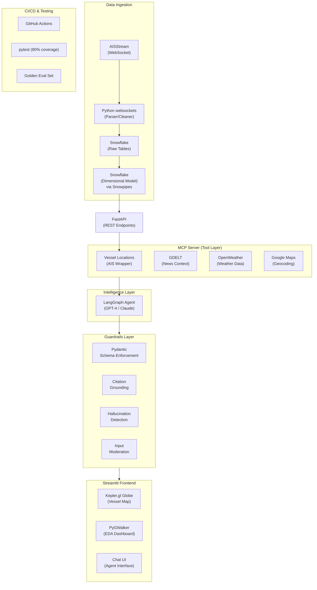
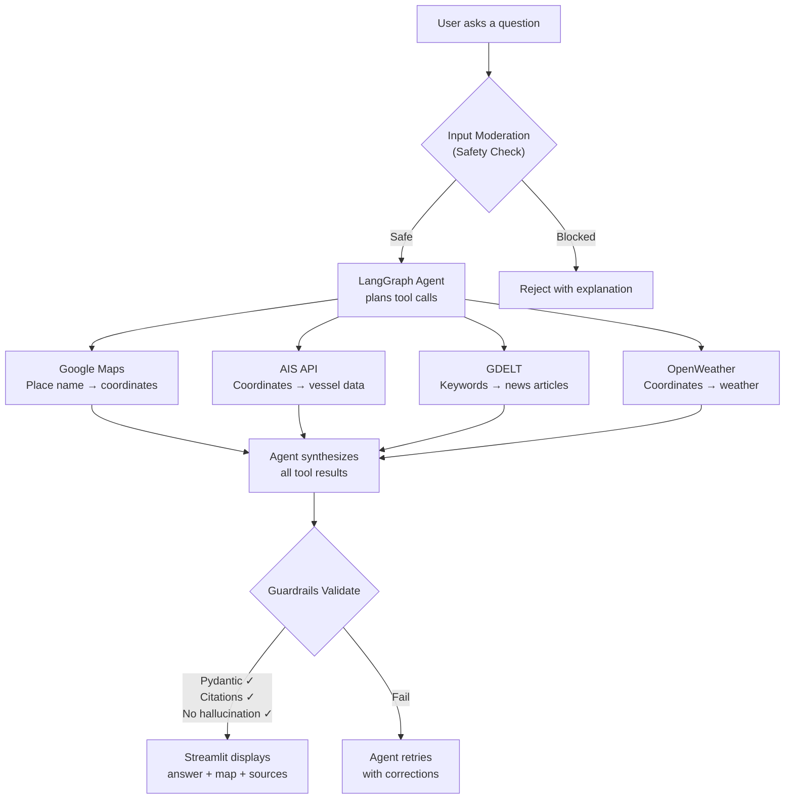
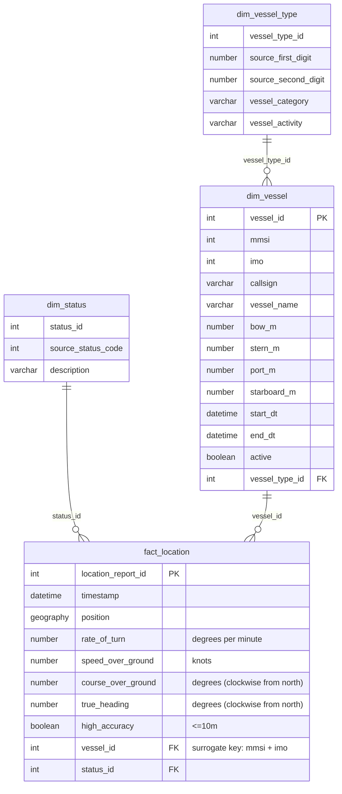

# AIS Vessel Tracking

## Problem Statement

Currently, publicly available vessel tracking data is unwieldy and difficult to get insights from. Available options include:
1. Joining the AIS network (requires purchase/operation of expensive equipment)
2. Filing Freedom-of-Information-Act requests with the US Coast Guard
3. Streaming raw data from a WebSocket (not user-friendly or useful for analytics)

However, this data has a lot of valuable applications, including logistics, early market warnings, and national security.

To that end, we aim to create a big-data pipeline that reads the available AIS feed into a data warehouse. We will design an API layer that provides useful methods for accessing the data. Finally, we will provide a sample application for the data, including sophisticated agent for answering questions using the APIs we create + additional third-party integrations.

## System Architecture

### Data Flow (Query Lifecycle)

## Data Sources

| Source | What Data? | How to Access? | Why We Need It? | What It Returns? | Limitations |
|--------|-----------|----------------|-----------------|------------------|-------------|
| **[AISStream](https://aisstream.io)** | Ship positions, speed, heading, identity, type, dimensions — broadcast by every commercial vessel globally | WebSocket via Python `websockets`. Data ingested into Snowflake via Snowpipes. Served through FastAPI. | Core data source. Answers "where are ships?" and "how are they moving?" Feeds the dimensional model. | MMSI, IMO, ship name, lat/lon, speed, course, heading, rate of turn, nav status, ship type, dimensions. ~6,000 msgs/min globally. | No cargo info. Ships can go dark. GPS spoofing possible. Open ocean gaps. Websocket disconnects lose data. |
| **[GDELT](https://blog.gdeltproject.org/gdelt-geo-2-0-api-debuts/)** | Global news articles — titles, sources, dates, countries, tone scores, locations. 100+ languages, updates every 15 min. | REST API or Python `gdeltdoc` library. Pass keyword + date range, get articles. No auth needed. | Provides the "why." If AIS shows traffic dropped, GDELT explains the cause — conflict, sanctions, disaster. | URL, title, date, domain, language, source country, tone. Up to 250 articles/query. Last 3 months (DOC) or 7 days (GEO). | English-language bias. Noisy results. Geocoding errors. 15-min delay. Rate limiting. |
| **[OpenWeatherMap](https://openweathermap.org/api)** | Weather conditions at any lat/lon — temperature, wind, humidity, visibility, pressure, clouds, description. | REST API with API key. Pass lat + lon, get JSON. Free tier: 1,000 calls/day (v2.5). | Verification layer. Confirms or rules out weather as cause of shipping anomalies. | Temp (°C), feels_like, humidity (%), wind_speed (m/s), wind_deg, visibility (m), pressure (hPa), description. | Point data only. Free tier = current only. Historical needs paid plan. No wave height. |
| **[Google Maps](https://mapsplatform.google.com/maps-products/)** | Geocoding — converts place names into lat/lon coordinates and bounding boxes. | REST API with API key. Pass place name, get coordinates. Requires billing. Alt: Nominatim (free). | The glue. Users type place names, but all other APIs need coordinates. Without it, agent can't translate questions. | Formatted address, lat, lon, bounding box (NE + SW), location type. Bounding boxes used for AIS area queries. | Maritime terms may resolve poorly. Open ocean fails. Some ports return point only. |

**How they connect:** Google Maps converts place names → coordinates. AIS uses coordinates → vessel traffic data. GDELT uses keywords → news context. OpenWeather uses coordinates → weather conditions. The LangGraph agent orchestrates all four to produce complete answers.

## Data Volume Estimates

Based on observed ingestion rate of ~100 messages/second from the AISStream global feed.

| Source | Data Type | Per Day | 2 Weeks (Project) |
|--------|-----------|---------|---------------------|
| **AISStream** | Vessel position reports | ~8.6M messages (~6.5 GB raw, ~1.3 GB compressed) | ~120M messages (~90 GB raw, ~18 GB compressed) |
| **AISStream** | Unique vessels tracked | ~10,000–15,000 | ~60,000+ |
| **AISStream** | Rows in fact_location | ~6–7 million | ~90 million |
| **GDELT** | News articles retrieved | ~25,000 articles (~25 MB) | ~350,000 articles (~350 MB) |
| **OpenWeather** | Weather lookups | ~100 responses (~300 KB) | ~1,400 responses (~4 MB) |
| **Google Maps** | Geocoding lookups | ~100 responses (~200 KB) | ~1,400 responses (~3 MB) |
| **Total** | All sources combined | ~6.5 GB raw / ~1.3 GB stored | ~90 GB raw / ~18.4 GB stored |

> **Note:** If AIS ingestion is filtered to key maritime chokepoints (Hormuz, Suez, Panama, Malacca, Red Sea), volumes reduce to ~10–15% of the above. GDELT, OpenWeather, and Google Maps are queried on-demand by the agent and not stored long-term.

## Technology Stack

| Layer | Technology | Why This Choice |
|-------|-----------|-----------------|
| Ingestion | Python `websockets` | Lightweight async library, handles AISStream's WebSocket natively |
| Data Warehouse | Snowflake | Handles semi-structured JSON from AIS, scales with volume, Snowpipes automate loading |
| API | FastAPI | Fast, async, auto-generates OpenAPI docs, easy to wrap as MCP tool |
| Agent Framework | LangGraph | Built for multi-step agentic workflows with tool calling, supports state management between steps |
| LLM | GPT-4 / Claude | Strong reasoning for multi-source synthesis, good at deciding which tools to call |
| Guardrails | Pydantic + custom validators | Pydantic is the standard for schema validation in Python, integrates naturally with FastAPI |
| Frontend | Streamlit | Quick to build data apps, supports Kepler.gl and PyGWalker as components |
| CI/CD | GitHub Actions | Free for public repos, runs pytest and linting on every push |
| Geocoding | Google Maps API / Nominatim | Google is most accurate; Nominatim as free fallback |
| News | GDELT | Free, no API key, covers 100+ languages, updates every 15 min |
| Weather | OpenWeather API | Simple REST interface, free tier sufficient for our usage |

## Components

### AIS Tracker
1. Data ingested via websocket from [AISStream](https://aisstream.io)
2. Data is parsed and cleaned, then passed into raw tables
3. Data from raw tables is loaded to dimensional model using Snowpipes
4. Data in Snowflake is provided to end applications via FastAPI

#### Dimensional model

#### API endpoints

- **/vessels**
    - List all vessels, filtering by vessel characteristics or time/place spotted
- **/vessels/{mmsi}**
    - Get details for a specific vessel using its MMSI (source key)
- **/vessels/{mmsi}/logs**
    - Get list of all position reports published by a vessel in a specified timeframe
    - Can be used for trajectory analysis or plotting

### MCP Server

Wraps all external services into a standard tool interface for the LangGraph agent:

| Tool | Wraps | Input | Output |
|------|-------|-------|--------|
| `get_vessel_positions` | AIS Tracker (FastAPI) | Bounding box + date range | Vessel counts, names, positions |
| `search_news` | GDELT API | Keyword + date range | Article titles, sources, URLs |
| `get_weather` | OpenWeather API | Lat/lon + optional date | Temperature, wind, conditions |
| `geocode_location` | Google Maps API | Place name (text) | Lat, lon, bounding box |

These are provided for use in agentic workflows to answer questions such as:

> How has the Iran conflict affected traffic around the Strait of Hormuz?

> How does the number of ships harbored in Sydney Harbor compare to 2 years ago?

> How long did it take ship 219032032 to pass through the Panama Canal on Wednesday?

### LangGraph Agent

The agent is an LLM (GPT-4 or Claude) with access to the four MCP tools. When a user asks a question, the agent figures out which tools it needs, calls them in the right order, and combines the results into one answer.

For example, if someone asks "Why has shipping dropped near Hormuz?", the agent would:
1. Call `geocode_location("Strait of Hormuz")` to get coordinates
2. Call `get_vessel_positions` with those coordinates to confirm the traffic drop
3. Call `search_news("strait hormuz shipping")` to find the reason
4. Call `get_weather` at those coordinates to rule out weather as a cause
5. Put it all together into a single answer with sources

The agent doesn't always call all four tools — a simple question like "Where is ship X?" only needs the AIS API. The agent decides based on what the question actually needs.

**System prompt approach:** The agent's system prompt tells it to act as a maritime analyst, always check multiple sources before drawing conclusions, cite its sources, and avoid making claims it can't back up with data.

### Guardrails & Human-in-the-Loop

All agent responses pass through four checks before reaching the user:

| Guardrail | What It Does |
|-----------|-------------|
| **Input Moderation** | Checks the user's question for safety before it reaches the agent. Blocks harmful or off-topic queries. |
| **Pydantic Schema Enforcement** | Validates that the agent's response has the right structure — answer text, sources list, confidence score. If the format is wrong, the agent retries. |
| **Citation Grounding** | Makes sure every claim in the answer maps back to a real data source. If the agent says "traffic dropped 93%", there must be an AIS query result backing that number. |
| **Hallucination Detection** | Compares the agent's final answer against the raw tool outputs. If the agent says something that wasn't in any tool response, it gets flagged and regenerated. |

**Human-in-the-Loop:** Users can flag any agent response as incorrect using a thumbs-down button in the Streamlit chat. Flagged responses get logged for review and are added to the evaluation set to improve the agent over time. For high-stakes queries (e.g., security-related), the system can be configured to require human review before displaying results.

### Streamlit Frontend

| Component | Purpose |
|-----------|---------|
| **Kepler.gl Globe** | Interactive 3D map showing vessel positions and trajectories. Users can zoom into specific regions, filter by vessel type, and watch traffic patterns. |
| **PyGWalker** | Drag-and-drop EDA dashboard. Users can explore vessel statistics — busiest ports, vessel type distributions, speed patterns — without writing any code. |
| **Chat UI** | The main intelligence interface. Users type natural language questions, the agent processes them through the MCP tools and guardrails, and the answer appears with citations and relevant map highlights. |

### Testing & Evaluation

| Area | What We're Doing |
|------|-----------------|
| **Unit Tests** | pytest suite covering ETL parsing, API endpoints, guardrail validators, and agent tool calls. Target: 80% code coverage. |
| **Golden Eval Set** | A curated set of 30-50 question-answer pairs with known correct answers. We run the agent against this set and measure how often it gets the right answer with proper citations. |
| **Eval Metrics** | Agent accuracy (% of golden set answered correctly), response latency (target < 5 seconds for simple queries, < 15 seconds for multi-tool queries), citation accuracy (% of claims with valid source). |
| **CI/CD** | GitHub Actions runs the full pytest suite on every push. PRs can't merge if tests fail. |

## Project Plan & Timeline

| Week | Milestone | What Gets Done |
|------|-----------|---------------|
| Week 1 | Data pipeline up | AIS websocket running, Snowflake raw tables receiving data, Snowpipes transforming to dimensional model |
| Week 2 | API + MCP ready | FastAPI endpoints working, MCP server wrapping all 4 external services, basic agent calling tools |
| Week 3 | Agent + Guardrails | LangGraph agent answering multi-source questions, all 4 guardrails implemented and tested |
| Week 4 | Frontend + Polish | Streamlit app with Kepler.gl, PyGWalker, and Chat UI. Golden eval set created and run. |
| Week 5 | Testing + Demo prep | pytest at 80% coverage, CI/CD green, final demo rehearsal, documentation complete |

## Risks & Mitigation

| Risk | Impact | How We Handle It |
|------|--------|-----------------|
| **WebSocket disconnects** | Gaps in AIS data, missing ship positions | Auto-reconnect with exponential backoff. Log disconnect times so we know where gaps are. |
| **AIS data quality** | Blank ship names, bad coordinates, spoofed positions | ETL pipeline validates coordinates (reject 0,0 or on-land positions), normalizes ship names, flags suspicious MMSI changes. |
| **GDELT noise** | Irrelevant articles mixed in with useful results | Agent filters by relevance. Guardrails check that cited articles actually relate to the query topic. |
| **API rate limits** | GDELT and OpenWeather throttle rapid calls | Cache recent results in Snowflake. Space out API calls. GDELT has no key so rate limits are generous. OpenWeather free tier is 1,000 calls/day which is enough. |
| **LLM hallucination** | Agent makes up facts not in the data | Hallucination detection guardrail compares answer against tool outputs. Citation grounding ensures every claim has a source. |
| **High LLM token cost** | Budget overrun from long agent conversations | Cache common queries. Keep system prompts concise. Use cheaper models for simple lookups, save GPT-4 for complex multi-tool questions. |
| **Scaling issues** | Snowflake storage grows fast at global ingestion rates | Filter ingestion to key chokepoints for POC. Architecture supports scaling to global later. |

## Expected Outcomes & KPIs

| Metric | Target |
|--------|--------|
| AIS ingestion uptime | > 95% over project duration |
| Snowflake rows loaded | > 50 million position reports |
| Unique vessels tracked | > 40,000 |
| Agent accuracy on golden set | > 80% correct answers |
| Agent response time (simple query) | < 5 seconds |
| Agent response time (multi-tool query) | < 15 seconds |
| Citation accuracy | > 90% of claims backed by a real source |
| Test coverage | > 80% (pytest) |
| CI/CD pipeline | Green on every merge to main |

## Token & Cost Report

We'll track LLM usage throughout the project and report on:

- **Total tokens consumed** — logged per agent query (input tokens + output tokens), broken down by simple vs. complex queries
- **Cost per query** — average cost for a single-tool query vs. a multi-tool query that hits all 4 sources
- **Main cost drivers** — the system prompt, tool call descriptions, and GDELT article summaries are the biggest token consumers
- **How we keep costs down:**
  - Cache frequent geocoding results (users ask about the same 10-20 locations repeatedly)
  - Keep the system prompt under 500 tokens
  - Summarize GDELT articles before passing to the agent (send titles + key sentences, not full text)
  - Use cheaper models (GPT-3.5 / Haiku) for simple lookups like "where is ship X?" and reserve GPT-4 / Claude for complex reasoning queries
  - Batch similar questions when possible

## Work Distribution

| Member | Responsibilities |
|--------|-----------------|
| **Seamus** | AIS ingestion pipeline, Snowflake dimensional model, Snowpipes, FastAPI backend |
| **Deep** | MCP server, LangGraph agent, LLM integration, prompt engineering |
| **Tapan** | Streamlit frontend (Kepler.gl, PyGWalker, Chat UI), all 4 guardrails, pytest suite, golden eval set, CI/CD via GitHub Actions |
