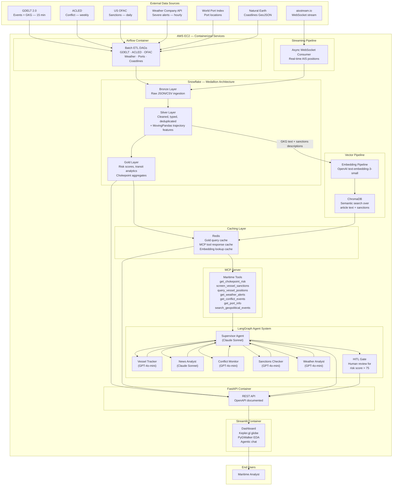
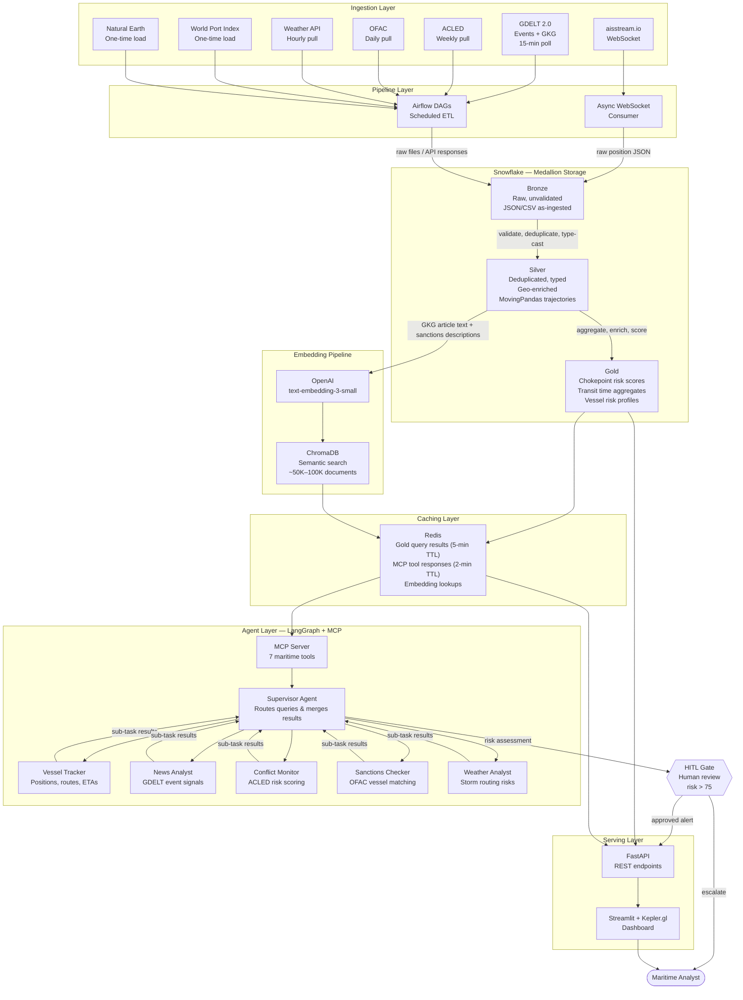

# Final Project Proposal
**DAMG 7245 — Big Data and Intelligent Analytics**

## Team Members
- Deep Prajapati
- Tapan Patel
- Seamus McAvoy

### Attestation (Required)
WE ATTEST THAT WE HAVEN'T USED ANY OTHER STUDENTS' WORK IN OUR ASSIGNMENT AND ABIDE BY THE POLICIES LISTED IN THE STUDENT HANDBOOK.

- Deep Prajapati: 33.3%
- Tapan Patel: 33.3%
- Seamus McAvoy: 33.3%

---

## 1. Title
**Maritime AI Sentinel:** Global Maritime Supply Chain Resilience via Geopolitical Event Tracking and Agentic AI

---

## 2. Introduction

### 2.1 Background
Global maritime shipping carries over 80% of international trade by volume ([UNCTAD Review of Maritime Transport 2024](https://unctad.org/publication/review-maritime-transport-2024)). The industry faces an unprecedented convergence of disruptions: geopolitical conflicts redirecting shipping routes (Red Sea / Houthi attacks adding 10–14 days to Asia–Europe voyages), climate events blocking critical chokepoints (Panama Canal drought 2023–24 cutting daily transits from 36 to 24), and evolving sanctions regimes requiring real-time compliance screening. These events cascade through global supply chains, causing port congestion, container shortages, freight rate volatility, and billions in delayed goods.

Today, maritime intelligence is fragmented. Vessel tracking data (AIS) sits in one silo, geopolitical event feeds in another, sanctions lists in a third, and weather/other sources in yet another. Analysts at logistics firms, insurers, and commodity traders must manually cross-reference these sources to assess risk—a process that is slow, error-prone, and fundamentally unscalable. No single platform provides an integrated, AI-driven view that continuously monitors geopolitical events, correlates them with live vessel movements, and proactively recommends supply chain adjustments.

According to [Everstream Analytics](https://www.everstream.ai/), geopolitical fragmentation and strategic use of trade regulations is rated at a **97% threat level** for 2026. Meanwhile, [BCG research](https://www.bcg.com/) shows agentic AI systems accounted for 17% of total AI value in 2025, projected to reach 29% by 2028—making this the ideal moment to apply agentic AI to maritime risk intelligence.

This project addresses that gap by building **Maritime AI Sentinel**—a cloud-native, agentic AI platform that ingests high volumes of heterogeneous maritime and geopolitical data, fuses them through big-data pipelines, and deploys a LangGraph-based multi-agent system to deliver real-time risk intelligence and actionable rerouting recommendations.

### 2.2 Objective
The primary goals of this project are:

- **Big Data Engineering:** Ingest, process, and store 60+ GB of multi-source maritime and geopolitical data in Snowflake using Airflow-orchestrated batch and near-real-time pipelines with a medallion architecture (Bronze/Silver/Gold).

- **Significant LLM Use:** Deploy a LangGraph multi-agent system with 5 specialist agents (vessel tracker, news analyst, conflict monitor, sanctions checker, weather analyst) using Claude and OpenAI models with RAG over vector-embedded evidence, connected via MCP tool protocol.

- **Cloud-Native Architecture:** Fully containerized (Docker) services hosted on AWS EC2, with CI/CD via GitHub Actions, Airflow orchestration, and Snowflake as the central data warehouse.

- **User-Facing Application:** Streamlit dashboard with Kepler.gl interactive globe visualization, real-time alert feed, vessel search, risk heatmaps, and agentic chat interface for natural language supply chain queries.

---

## 3. Project Overview

### 3.1 Scope

#### In Scope
- **Data Sources (7 external sources + 1 application-defined reference dataset)**
  - [aisstream.io](https://aisstream.io) — Real-time vessel locations streamed via WebSocket
  - [GDELT 2.0](https://www.gdeltproject.org) — Global news event database (Events + GKG), updates every 15 min
  - [ACLED](https://acleddata.com) — Conflict event monitoring, weekly updates + forecasts (CAST)
  - [US OFAC via OpenSanctions](https://www.opensanctions.org/datasets/us_ofac_cons/) — Active maritime sanctions, daily refresh
  - [The Weather Company API](https://developer.weather.com/docs) — Global severe weather alerts, hourly refresh
  - [World Port Index](https://data.humdata.org/dataset/world-port-index) — 3,600+ port locations and characteristics
  - [Natural Earth Coastlines](https://www.naturalearthdata.com/downloads/10m-physical-vectors/10m-coastline/) — GeoJSON global coastlines
  - **Chokepoint Reference Data** (application-defined) — Bounding boxes, names, and trade percentages for 10 critical maritime straits, manually curated from published maritime geography (see Appendix A)

- **ETL Pipelines**
  - Apache Airflow DAGs for all batch sources (GDELT, ACLED, OFAC, Weather, Ports, Coastlines)
  - Python async WebSocket consumer for streaming AIS data
  - Snowflake Snowpipe / staged ingestion for Bronze layer loading
  - Medallion architecture: Bronze (raw) → Silver (cleaned, typed, deduplicated) → Gold (aggregated, indexed)

- **LLM Components**
  - LangGraph supervisor agent orchestrating 5 specialist agents
  - MCP server exposing maritime data tools (chokepoint risk, vessel lookup, sanctions screen, semantic search, etc.)
  - RAG pipeline: OpenAI embeddings → ChromaDB vector store → context retrieval into agent prompts
  - Human-in-the-Loop (HITL) gates for high-risk alerts (risk score > 75)

- **Cloud Infrastructure**
  - AWS EC2 hosting Docker containers: Airflow, FastAPI, Streamlit, ChromaDB, Redis, AIS consumer
  - Snowflake as central data warehouse
  - GitHub Actions CI/CD pipeline

- **Guardrails & HITL**
  - Pydantic schema enforcement on all agent outputs
  - Citation grounding — every agent claim must reference a source document
  - HITL approval panel in Streamlit for high-risk advisories

- **Evaluation Strategy**
  - Golden set of 50 curated query–response pairs
  - ArkSim synthetic user simulation for stress testing agents
  - LangSmith tracing for latency, token usage, and cost tracking

#### Out of Scope
- Real-time algorithmic trading or financial execution
- Custom AIS hardware receiver deployment
- Production-grade SLA guarantees (academic/portfolio project)
- Quantum computing components

### 3.2 Stakeholders / End Users

| Stakeholder | Use Case | Value |
|---|---|---|
| Logistics / Freight Forwarders | Monitor vessel ETAs, detect delays from geopolitical events | Proactive rerouting saves $50K–$500K per disruption |
| Commodity Traders | Track commodity flows through chokepoints | Early warning on supply shocks, arbitrage signals |
| Marine Insurance Underwriters | Assess war-risk premiums by region | Data-driven premium adjustments |
| Port Authorities | Forecast congestion from rerouted traffic | Optimized berth allocation |

---

## 4. Problem Statement

### 4.1 Current Challenges
- **Data Fragmentation:** AIS data (vessel positions), geopolitical event feeds (GDELT/ACLED), sanctions lists (OFAC), and weather data exist in completely separate systems with incompatible schemas, temporal granularities, and geographic reference systems.

- **Manual Workflows:** Maritime risk analysts spend 4–8 hours daily cross-referencing multiple dashboards (MarineTraffic, Reuters, Treasury.gov) to produce a single risk assessment. This is fundamentally unscalable during crisis escalation.

- **Lack of Intelligent Automation:** Current tools provide data but no reasoning. No platform can answer: *"If the Strait of Hormuz is blockaded, which of our vessels are at risk, what is the cost impact, and what are the best alternative routes?"*

- **Big Data Bottlenecks:** AIS data alone generates ~300M position reports daily globally. GDELT produces 2.5TB+ annually. Processing this at scale requires distributed compute that most maritime analysts lack access to.

- **LLM Hallucination Risk:** Applying LLMs naively to high-stakes maritime decisions is dangerous. Hallucinated sanctions matches or false rerouting recommendations could cost millions or create legal liability.

### 4.2 Opportunities
- **Scalable Pipelines:** Snowflake's elastic compute + Airflow orchestration enables processing of multi-TB maritime datasets with pay-per-use economics.

- **LLM-Assisted Analysis:** A LangGraph multi-agent system can decompose complex supply chain questions into sub-tasks (sanctions check, route analysis, risk scoring) handled by specialist agents—mimicking a team of human analysts at 100x speed.

- **Automated Decision Support:** RAG-grounded agents with HITL gates enable confident, citation-backed rerouting advisories that humans can trust and approve.

- **Near-Real-Time Insights:** Streaming AIS data + 15-minute GDELT updates + weekly ACLED refreshes + hourly weather alerts provide a continuously updated risk picture.

---

## 5. Methodology

### 5.1 Data Sources

| Source | Type / Format | Access Method | Volume (est.) | Refresh Cadence |
|---|---|---|---|---|
| **aisstream.io** | AIS vessel positions (JSON) | Free WebSocket API (API key) | ~500 MB/day × 22 days = **~11 GB** | Real-time streaming |
| **GDELT 2.0 Events** | Geopolitical events — structured rows with CAMEO codes, actors, locations (CSV) | BigQuery (free 1TB/mo) + gdeltPyR | 50 MB/day × 90 days = **4.5 GB** | Every 15 minutes |
| **GDELT 2.0 GKG** | Global Knowledge Graph — article-level themes, tone scores, entities, source URLs (CSV) | BigQuery + CSV download | 500 MB/day × 90 days = **45 GB** | Every 15 minutes |
| **ACLED** | Conflict events (CSV/JSON) | REST API (free academic registration) | ~50 MB for 1997–present archive | Weekly (Tuesdays) |
| **US OFAC (OpenSanctions)** | Sanctions entities + vessels (JSON) | Bulk download (free non-commercial) | ~5 MB (maritime subset) | Daily |
| **Weather Company API** | Severe weather alerts (JSON) | REST API (freemium) | ~300 MB/month (global severe alerts) | Hourly |
| **World Port Index** | Port metadata + coordinates (CSV) | HDX download | ~70 MB (static) | Annual |
| **Natural Earth Coastlines** | Coastline boundaries (GeoJSON) | Direct download | ~10 MB (static) | Static |

**Total Expected Volume: ~61 GB** (GDELT GKG backfill: 45 GB + AIS streaming: 11 GB + GDELT Events: 4.5 GB + remaining sources: ~0.5 GB)

> **Why two GDELT tables?** The Events DB and GKG serve fundamentally different roles in the architecture. **GDELT Events** provides structured, coded rows (who did what to whom, where, when, CAMEO event code) — these go into Snowflake Silver/Gold tables for structured SQL queries like *"count all military actions within 100km of the Suez Canal in the last 7 days."* **GDELT GKG** provides article-level text data (themes, tone, entities, source URLs) — this text is what gets embedded into ChromaDB for semantic search (RAG), enabling agents to answer open-ended questions like *"what is the current geopolitical sentiment around Strait of Hormuz?"* Without Events, there are no structured aggregates to query. Without GKG, there is no text corpus to embed for RAG. They feed different layers of the system.

### 5.2 Technology Stack

| Layer | Technology | Why This Over Alternatives |
|---|---|---|
| **Cloud Data Warehouse** | Snowflake | Elastic compute, native semi-structured JSON support, Snowpipe for streaming ingest, zero-copy cloning for dev/prod. Chosen over BigQuery (higher cost at scale) and Redshift (less flexible scaling). |
| **Orchestration** | Apache Airflow (Docker) | Industry-standard DAG orchestration with rich operator ecosystem, including Snowflake operators. Chosen over Prefect (smaller community) and Dagster (less mature). |
| **Streaming Ingest** | Python asyncio + WebSocket | aisstream.io delivers AIS via WebSocket; async Python is the lightest-weight consumer. Chosen over Kafka (overkill for single-source academic project). |
| **Compute / Processing** | Snowflake SQL + Snowpark Python UDFs | Process data where it lives. Snowpark for feature engineering within the warehouse. Chosen over Spark/EMR (additional infra cost and operational overhead). |
| **LLM Providers** | Claude Sonnet + OpenAI GPT-4o-mini | Claude for complex reasoning agents; GPT-4o-mini for high-volume classification. Dual-provider for cost optimization + resilience. |
| **Embeddings** | OpenAI text-embedding-3-small (1536d) | Best cost/quality ratio at $0.02/1M tokens. Chosen over Cohere (fewer integrations) and local models (GPU-limited). |
| **Vector Store** | ChromaDB (self-hosted Docker) | Semantic search over unstructured text (news articles, sanctions descriptions) that cannot be queried via SQL. Zero-cost, persistent, good Python integration. Chosen over Pinecone (paid) and Weaviate (heavier infra). |
| **Caching** | Redis (Docker) | In-memory cache for Snowflake Gold query results, MCP tool responses, and embedding lookups. Reduces Snowflake compute costs and agent response latency. Chosen over Memcached (less feature-rich, no persistence). |
| **Agentic Framework** | LangGraph | Graph-based stateful multi-agent orchestration with HITL gates, conditional branching, and LangSmith observability. Chosen over CrewAI (less control over graph topology) and AutoGen (less production-ready). |
| **Tool Protocol** | MCP (Model Context Protocol) | Exposes maritime data as structured tools for agents (get_chokepoint_risk, screen_vessel, etc.). Standardized JSON-RPC protocol for agent ↔ tool communication. |
| **Agent Testing** | ArkSim (Arklex AI) | Simulates multi-turn conversations with synthetic users to stress-test agents pre-production. Introduced in DAMG 7245 class. |
| **Trajectory Analytics** | MovingPandas | Stop detection, trajectory splitting, transit time computation on AIS tracks. Purpose-built for movement data analysis. |
| **API Layer** | FastAPI | Async, auto-OpenAPI docs, Pydantic validation. Chosen over Flask (sync) and Django (too heavy for API-only service). |
| **Frontend** | Streamlit + Kepler.gl | Rapid prototyping with Kepler.gl for GPU-rendered geospatial visualization (3D arcs, hexbin heatmaps). Chosen over React (time constraint for a 22-day project). |
| **EDA / Exploration** | PyGWalker | Tableau-like interactive exploration inside Streamlit. Drag-and-drop visual analysis without a separate BI tool. |
| **CI/CD** | GitHub Actions | Free for public repos, tight GitHub integration, matrix builds for multi-service Docker testing. |
| **Containerization** | Docker + Docker Compose | Multi-service orchestration (Airflow, FastAPI, ChromaDB, Redis, Streamlit, AIS consumer). Consistent dev/prod environments. |
| **Project Management** | GitHub Projects Kanban + Issues | Integrated with the repository for issue tracking and sprint planning. |

### 5.3 Architecture

#### 5.3.1 Alternative Architectures Considered

We evaluated three architectural approaches before selecting our final design:

**Architecture A: Fully GCP-Native**
- BigQuery for storage + Dataproc for Spark processing + Cloud Run for APIs + Vertex AI for agents
- *Pros:* Tight integration, managed services, less ops overhead
- *Cons:* Higher cost for sustained compute, Vertex AI agent tooling less mature than LangGraph, vendor lock-in to GCP ecosystem
- *Verdict:* Rejected — LangGraph provides more flexible custom multi-agent orchestration, and Snowflake offers better semi-structured data handling for our JSON-heavy sources

**Architecture B: Kafka-Centric Streaming**
- Confluent Kafka for all data ingestion (AIS + batch sources) + Kafka Streams for processing + ksqlDB for analytics
- *Pros:* True real-time for all sources, unified streaming paradigm
- *Cons:* Massive infrastructure overhead for an academic project, overkill when only AIS needs real-time, Kafka cluster costs exceed budget
- *Verdict:* Rejected — streaming overhead doesn't justify the single real-time source (AIS); batch is more appropriate for GDELT/ACLED/OFAC

**Architecture C: Snowflake-Centric with Targeted Streaming (SELECTED)**
- Snowflake as central warehouse + Airflow for batch orchestration + async Python for AIS streaming + Redis for caching + LangGraph agents with MCP tools
- *Pros:* Batch pipelines cover 6/7 sources efficiently, streaming only where needed (AIS), Redis caching layer reduces warehouse load and agent latency, LangGraph provides maximum agent flexibility, MCP standardizes tool communication
- *Cons:* AIS streaming handled outside Snowflake (Python consumer → staged load), not a pure streaming architecture
- *Verdict:* **Selected** — best balance of cost, complexity, and capability for a 22-day project timeline

#### 5.3.2 System Architecture Diagram



#### 5.3.3 Data Flow Diagram



### 5.4 Data Processing & Transformation

#### Dual-Store Architecture: Snowflake + ChromaDB

This project uses two complementary data stores because the data is both structured and unstructured:

- **Snowflake** handles all structured, numeric, and relational data — vessel positions, CAMEO-coded event records, conflict statistics, risk score aggregates, port metadata. These are queried via standard SQL (e.g., *"count military events within 100km of Suez in the last 7 days"*).
- **ChromaDB** handles unstructured text that requires semantic search — GDELT GKG article summaries, ACLED event narratives, OFAC sanctions descriptions. These cannot be meaningfully queried with SQL; instead, agents use vector similarity search to find contextually relevant documents (e.g., *"find recent reporting similar to the 2024 Red Sea shipping crisis"*).

This split is why the project ingests both GDELT Events (structured → Snowflake) and GDELT GKG (text → ChromaDB). Each feeds a different layer of the architecture. Agents access both stores through the MCP server — structured tools query Snowflake via Redis cache, while `search_geopolitical_events` performs vector search against ChromaDB.

#### Batch Processing (Airflow DAGs)
- **GDELT DAG** (runs every 15 minutes): Queries BigQuery for maritime-relevant events using CAMEO event codes (military actions, sanctions, blockades, naval activity). Downloads Events 2.0 rows into Snowflake Bronze for structured storage. Downloads GKG records and routes article-level text through the embedding pipeline into ChromaDB for semantic search.
- **ACLED DAG** (runs weekly, Tuesdays): Fetches conflict events via REST API, filters for coastal/port-adjacent events within 50km of known ports. Structured fields go to Snowflake Bronze; event description text is embedded into ChromaDB.
- **OFAC DAG** (runs daily): Downloads OpenSanctions OFAC consolidated dataset (JSON), parses for maritime-related entities (vessels, shipping companies). Structured entity records go to Snowflake Bronze; entity description text is embedded into ChromaDB for semantic sanctions screening.
- **Weather DAG** (runs hourly): Pulls severe weather alerts from Weather Company API for the 10 chokepoint regions defined in `dim_chokepoints`. Filters for storms/cyclones affecting shipping lanes. Writes to Snowflake Bronze.
- **Static data DAG** (runs once + monthly refresh): Loads World Port Index, Natural Earth coastlines, and the chokepoint reference data seed into Snowflake Bronze.

#### Stream Processing
- **AIS Consumer**: Python `asyncio` + `websockets` client connects to aisstream.io. Filters incoming positions by the bounding boxes defined in `dim_chokepoints` (Suez, Hormuz, Malacca, Panama, Bab el-Mandeb, Taiwan Strait, etc.). Batches 1,000 positions, writes to Snowflake via staged CSV upload every 60 seconds.
- **MovingPandas Processing**: Silver-layer Snowpark UDF applies MovingPandas trajectory analysis on batched AIS positions — computing stop detection (vessels stationary > 2 hours near ports), transit time through chokepoints, and speed anomalies that may indicate distress or evasion.

#### Chokepoint Reference Data

Chokepoints are **application-defined reference data**, not sourced from any external API. We manually curate a seed dataset of 10 critical maritime straits (see Appendix A) with the following attributes per chokepoint: name, lat/lon bounding box coordinates, region label, and approximate percentage of global trade. This seed data is loaded into `dim_chokepoints` at initialization and serves as the geographic filter applied across the entire system:
- AIS positions are filtered to vessels within these bounding boxes
- GDELT/ACLED events are geo-tagged to the nearest chokepoint based on lat/lon proximity
- Weather alerts are pulled specifically for these regions
- Gold-layer risk scores are computed per chokepoint

The bounding box coordinates and trade percentages are derived from published maritime geography sources including the U.S. Energy Information Administration (chokepoint analysis), UNCTAD Review of Maritime Transport, and the International Chamber of Shipping.

#### Data Formats & Storage Schemas
- **Bronze**: Raw JSON/CSV stored as Snowflake `VARIANT` columns (semi-structured). No transformation — exact mirror of source data.
- **Silver**: Typed, deduplicated tables with consistent schemas:
  - `silver_vessel_positions` (mmsi, lat, lon, speed, heading, timestamp, chokepoint_id)
  - `silver_geopolitical_events` (event_id, cameo_code, actor1, actor2, lat, lon, tone, source_url, timestamp) — *from GDELT Events DB*
  - `silver_conflict_events` (acled_id, event_type, fatalities, country, lat, lon, date)
  - `silver_sanctions_entities` (entity_id, name, entity_type, program, vessel_imo, vessel_mmsi)
  - `silver_weather_alerts` (alert_id, severity, event_type, lat, lon, radius_km, valid_until)
  - `dim_ports` (port_id, name, country, lat, lon, max_draft, harbor_type) — *from World Port Index*
  - `dim_chokepoints` (chokepoint_id, name, bbox_coords, region, pct_global_trade) — *application-defined seed data*
- **Gold**: Materialized views and aggregated tables:
  - `gold_chokepoint_risk_score` — daily composite risk per chokepoint (geopolitical + weather + congestion)
  - `gold_vessel_risk_profile` — per-vessel sanctions probability + route risk
  - `gold_transit_analytics` — average transit times, delays, throughput per chokepoint
- **ChromaDB**: Embedded unstructured text — *from GDELT GKG, ACLED descriptions, OFAC entity descriptions*
  - Collection: `maritime_intelligence` (~50,000–100,000 documents)

#### Caching Strategy (Redis)
- **Gold Query Cache**: Frequently accessed Snowflake Gold aggregates (chokepoint risk scores, vessel profiles) cached in Redis with a 5-minute TTL. Prevents redundant warehouse queries when multiple agents or dashboard refreshes request the same data.
- **MCP Tool Response Cache**: Responses from MCP tools (e.g., `get_chokepoint_risk("hormuz")`) cached with a 2-minute TTL. Agents hitting the same tool within the window get instant responses without re-querying Snowflake.
- **Embedding Lookup Cache**: Recently queried ChromaDB results cached by query hash. Avoids re-embedding and re-searching for repeated or similar queries within a session.
- **AIS Latest Position Cache**: Most recent position per MMSI stored in Redis (key: `vessel:{mmsi}`, value: lat/lon/speed/heading/timestamp). Updated by the AIS consumer on every batch write. Enables sub-second vessel lookups without querying Snowflake.

#### Embedding Generation
- **Source documents**: GDELT GKG article themes/tone/entity summaries, ACLED event descriptions, OFAC entity descriptions
- **Model**: OpenAI `text-embedding-3-small` (1536 dimensions, $0.02/1M tokens)
- **Chunking**: 512-token chunks with 64-token overlap for articles; single-chunk for sanctions entities
- **Metadata filters**: region, date, severity_score, source_type, cameo_code
- **Store**: ChromaDB collection `maritime_intelligence` with ~50,000–100,000 documents

### 5.5 LLM Integration Strategy

#### Multi-Agent Architecture (LangGraph + MCP)

The intelligence engine uses a **LangGraph supervisor pattern** with 5 specialist agents, connected to Snowflake and ChromaDB via an **MCP server** with a **Redis caching layer** in between:

| Agent | LLM | Role | MCP Tools Used |
|---|---|---|---|
| **Supervisor** | Claude Sonnet | Routes queries to specialists, merges results, manages state | All tools (dispatch) |
| **Vessel Tracker** | GPT-4o-mini | Tracks vessel positions, computes ETAs, detects AIS anomalies | `query_vessel_positions`, `get_port_info` |
| **News Analyst** | Claude Sonnet | Analyzes GDELT events for maritime impact, assesses escalation | `search_geopolitical_events` (vector search), `get_chokepoint_risk` |
| **Conflict Monitor** | GPT-4o-mini | Scores regions using ACLED data, flags emerging conflict zones | `get_conflict_events`, `get_chokepoint_risk` |
| **Sanctions Checker** | GPT-4o-mini | Screens vessels/entities against OFAC, detects evasion patterns | `screen_vessel_sanctions`, `query_vessel_positions` |
| **Weather Analyst** | GPT-4o-mini | Assesses storm/weather impact on shipping routes | `get_weather_alerts`, `get_chokepoint_risk` |

#### MCP Server Design
- **7 Tools**:
  - `get_chokepoint_risk` — Returns composite risk score for a chokepoint (queries Snowflake Gold via Redis cache)
  - `screen_vessel_sanctions` — Checks a vessel MMSI/IMO against OFAC sanctions (queries Snowflake + ChromaDB)
  - `query_vessel_positions` — Returns current/recent positions for a vessel or zone (queries Snowflake via Redis cache)
  - `get_weather_alerts` — Returns active severe weather alerts for a chokepoint region (queries Snowflake)
  - `get_conflict_events` — Returns recent ACLED conflict events for a region (queries Snowflake)
  - `get_port_info` — Returns port metadata and characteristics (queries Snowflake dim_ports)
  - `search_geopolitical_events` — Semantic vector search over GDELT GKG articles (queries ChromaDB via Redis cache)
- **2 Resources**: `chokepoint_list` (static reference), `active_alerts` (dynamic feed)
- **2 Prompts**: `maritime_risk_briefing`, `vessel_investigation`
- **Caching**: All tool responses pass through Redis before hitting Snowflake/ChromaDB. Cache hits bypass the data stores entirely, reducing both latency and compute cost.

#### Prompt Design
Each agent has a system prompt with:
1. Role definition and boundaries
2. Output schema (Pydantic JSON) — enforced by guardrails
3. Available MCP tools with descriptions
4. Citation requirement: every factual claim must reference a `source_id` from retrieved context
5. Escalation criteria: when to flag for HITL review
6. Few-shot examples from golden set (3–5 per agent)

#### RAG Strategy
1. User query or automated alert trigger → embed with same model → ChromaDB similarity search (k=10) via `search_geopolitical_events` tool, with metadata filters (date recency, region)
2. Top-k retrieved chunks + relevant Snowflake Gold aggregates (via structured MCP tools, served from Redis cache) injected into agent prompt
3. Agent generates response with inline citations
4. Guardrails module verifies citations exist in retrieved context

#### Agentic Workflow Example
**User asks:** *"What is the current risk for LNG tankers transiting the Strait of Hormuz?"*

1. Supervisor receives query → identifies geopolitical + weather + vessel dimensions → routes to News Analyst, Conflict Monitor, Weather Analyst, and Vessel Tracker in parallel
2. News Analyst: calls `search_geopolitical_events` to retrieve recent GDELT GKG articles about Hormuz from ChromaDB, calls `get_chokepoint_risk("hormuz")` for current aggregate score → produces risk narrative with citations
3. Conflict Monitor: calls `get_conflict_events` for ACLED data near Hormuz, pulls CAST forecast → scores regional conflict probability
4. Weather Analyst: calls `get_weather_alerts` for active severe weather in Hormuz corridor → assesses routing impact
5. Vessel Tracker: calls `query_vessel_positions` for LNG-flagged vessels near Hormuz (served from Redis AIS cache) → reports count, ETAs, and any anomalies
6. Supervisor: merges all sub-results → computes composite risk score (0–100) → if > 75, routes to HITL gate
7. Briefing output streamed to Streamlit chat interface with citations and recommended actions

### 5.6 Guardrails & Human-in-the-Loop (HITL)

| Guardrail | Implementation | Trigger |
|---|---|---|
| **Input Moderation** | Keyword filter + LLM classifier rejects off-topic/adversarial queries | All user inputs before agent routing |
| **Output Schema Enforcement** | Pydantic models for every agent output (`RiskScore`, `RouteAdvisory`, `SanctionsMatch`, `WeatherAlert`) | Every agent response validated; malformed → retry (max 3) |
| **Citation Grounding** | Post-processing check: every factual claim must map to a retrieved `source_id` | Ungrounded claims flagged and regenerated |
| **Hallucination Detection** | Cross-check agent risk scores against Snowflake Gold aggregates (delta > 20% → flag) | Risk Scorer and Vessel Tracker outputs |
| **Sanctions Accuracy Gate** | Fuzzy match threshold > 0.85 for positive sanctions match; below → HITL | Sanctions Checker outputs |
| **HITL Approval Gate** | Streamlit panel: analyst reviews, approves/rejects/edits | Risk score > 75, sanctions confidence 0.85–0.95, rerouting advisories |

### 5.7 Evaluations & Testing

#### LLM Evaluation Framework
- **Golden Set**: 50 curated query–response pairs covering all 5 agent types, with human-graded rubrics (accuracy 0–5, completeness 0–5, citation quality 0–5)
- **Automated Graders**: LLM-as-judge (Claude) scoring agent outputs against golden set rubrics. Run weekly.
- **ArkSim Stress Testing**: Synthetic user simulation with adversarial personas (confused analyst, sanctions evasion prober, off-topic attacker) to detect failure modes before production. ([ArkSim GitHub](https://github.com/arklexai/Agent-First-Organization))
- **LangSmith Tracing**: Every agent invocation traced for latency, token usage, tool calls, and error rates

#### Software Testing
- **Unit Tests** (pytest): ETL transformation functions, Pydantic schema validation, embedding pipeline, sanctions fuzzy matching, MovingPandas trajectory processing, Redis cache operations
- **Integration Tests**: End-to-end Airflow DAG runs on sample data, FastAPI endpoint response validation, agent workflow with mock LLM responses, Redis cache hit/miss verification
- **CI Pipeline**: GitHub Actions → lint (ruff) → type check (mypy) → unit tests → integration tests → Docker build

#### Metrics

| Metric | Target | Measurement |
|---|---|---|
| Agent accuracy (golden set) | ≥ 4.0 / 5.0 average | LLM-as-judge rubric |
| Sanctions match precision | ≥ 90% | Manual review of top-50 matches |
| End-to-end latency (single query) | < 30 seconds | LangSmith P95 |
| Redis cache hit rate | ≥ 70% for Gold queries | Redis `INFO stats` monitoring |
| AIS ingest throughput | ≥ 5,000 positions/min | Snowflake ingestion monitoring |
| API response time (P95) | < 2 seconds | FastAPI logging |
| Token cost per query | < $0.05 average | LangSmith cost tracking |
| Test coverage | ≥ 80% | pytest-cov |

### 5.8 Proof of Concept (POC)

The following POC components will be developed and committed to the GitHub repository:

#### POC 1: AIS Streaming Ingest
- Python async WebSocket client connecting to aisstream.io
- Filter by Suez Canal bounding box → print vessel names, positions, speeds
- Demonstrates: real-time data acquisition, JSON parsing, geographic filtering

#### POC 2: GDELT Geopolitical Event Extraction
- `gdeltPyR` query for maritime/shipping-related events in the last 30 days
- EDA notebook: event frequency by country, tone distribution, top actors, CAMEO code breakdown
- Demonstrates: big-data querying, preliminary analytics, data volume validation

#### POC 3: Sanctions Embedding + Semantic Search
- Download OFAC dataset from OpenSanctions, parse JSON, extract vessel entries
- Embed descriptions with `text-embedding-3-small`, store in ChromaDB
- Demo: fuzzy semantic search for vessel name returns relevant sanctions records
- Demonstrates: vector pipeline, RAG retrieval, sanctions screening concept

#### POC 4: Single-Agent LangGraph Demo
- Minimal LangGraph graph with one News Analyst agent
- Agent receives a question about Red Sea shipping risk → retrieves context from ChromaDB via `search_geopolitical_events` tool → produces a cited risk assessment using Pydantic output schema
- Demonstrates: agentic workflow, RAG integration, structured output, MCP tool call

---

## 6. Project Plan & Timeline

### 6.1 Milestones

| Phase | Milestone | Dates | Key Deliverables |
|---|---|---|---|
| **M1** | Data Ingestion & Pipeline Setup | Apr 2–6 | All 7 data source connectors operational; chokepoint seed data loaded; raw data landing in Snowflake Bronze; AIS WebSocket consumer running |
| **M2** | Big Data Processing Pipeline | Apr 5–9 | Silver/Gold transformations in Snowflake; Airflow DAGs for all sources; data quality gates; MovingPandas trajectory processing |
| **M3** | Embedding + Vector Pipeline | Apr 7–10 | ChromaDB populated with ~50K documents from GKG + ACLED + OFAC text; embedding pipeline tested; metadata filters working |
| **M4** | LLM Integration + Agents + Guardrails | Apr 9–15 | LangGraph supervisor + 5 agents; MCP server with 7 tools; Redis caching layer; RAG retrieval; Pydantic schemas; HITL gate |
| **M5** | Backend APIs | Apr 12–16 | FastAPI endpoints for risk scores, vessel search, agent chat, alert feed; OpenAPI docs |
| **M6** | Frontend / Dashboard | Apr 14–19 | Streamlit dashboard with Kepler.gl globe, PyGWalker EDA, risk heatmaps, agentic chat interface |
| **M7** | Testing + Evals | Apr 18–22 | Golden set evals, ArkSim stress tests, unit/integration tests, CI pipeline green |
| **M8** | Deployment + Polish | Apr 20–24 | Docker Compose on AWS EC2, README finalized, Codelabs doc, video recording, final submission |

### 6.2 Timeline (Gantt)

```
Apr 2  3  4  5  6  7  8  9  10 11 12 13 14 15 16 17 18 19 20 21 22 23 24
M1 ███████████░░░░░░░░░░░░░░░░░░░░░░░░░░░░░░░░░░░
M2 ░░░░░░███████████░░░░░░░░░░░░░░░░░░░░░░░░░░░░░
M3 ░░░░░░░░░░███████░░░░░░░░░░░░░░░░░░░░░░░░░░░░░
M4 ░░░░░░░░░░░░░░██████████████░░░░░░░░░░░░░░░░░░
M5 ░░░░░░░░░░░░░░░░░░░░██████████░░░░░░░░░░░░░░░░
M6 ░░░░░░░░░░░░░░░░░░░░░░░░██████████░░░░░░░░░░░░
M7 ░░░░░░░░░░░░░░░░░░░░░░░░░░░░░░░░██████████░░░░
M8 ░░░░░░░░░░░░░░░░░░░░░░░░░░░░░░░░░░░░██████████
```

> Milestones overlap intentionally — parallel execution is required given the 22-day timeline.

---

## 7. Team Roles & Responsibilities

| Member | Primary Role | Responsibilities |
|---|---|---|
| **Deep Prajapati** | LLM Engineer + ETL Lead | AIS streaming pipeline, GDELT/ACLED/OFAC ingestion, ChromaDB embedding pipeline, LangGraph multi-agent system (5 agents + supervisor), MCP server, Redis caching integration, prompt engineering, LangSmith eval setup, overall architecture |
| **Tapan Patel** | Cloud Architect + Data Engineer | Snowflake warehouse design (medallion schema), Airflow DAG development, Silver/Gold transformations, FastAPI backend, Docker Compose orchestration, AWS EC2 deployment, CI/CD pipeline |
| **Seamus McAvoy** | QA/Test Engineer + Frontend | Streamlit dashboard (Kepler.gl globe, PyGWalker, chat UI), guardrails implementation (Pydantic schemas, HITL panel), ArkSim agent testing, test suite (pytest), documentation (Codelabs, README), video coordination |

---

## 8. Risks & Mitigation

| Risk | Severity | Likelihood | Mitigation Strategy |
|---|---|---|---|
| aisstream.io rate limits or downtime | Medium | Medium | Exponential backoff + retry; cache last-known positions in Redis; fallback to batch snapshots |
| GDELT BigQuery free tier exhaustion | Medium | Low | Pre-filter to maritime CAMEO codes only; cache results in Snowflake; use gdeltPyR Doc API as backup |
| LLM hallucinations on risk scores | High | Medium | Citation grounding guardrail + cross-check against Snowflake Gold + HITL gate for high-risk outputs |
| Snowflake compute cost overrun | High | Medium | XS warehouse; 60-second auto-suspend; daily monitoring via `ACCOUNT_USAGE`; Redis caching to reduce query volume |
| API cost overrun (OpenAI/Claude) | Medium | Medium | GPT-4o-mini for high-volume tasks; prompt caching; embedding batch processing; daily token budget caps |
| 22-day timeline too aggressive | High | High | Parallel milestone execution; MVP-first (core pipeline + 3 agents, add 2 more if time permits); daily standups |
| ACLED API access delay | Low | Medium | Register immediately; fallback to HDX pre-aggregated CSV from [data.humdata.org](https://data.humdata.org/organization/acled) |
| Weather API rate limits | Low | Low | Cache hourly results in Redis; only poll for 10 chokepoint regions, not global |

---

## 9. Expected Outcomes & Metrics

### 9.1 KPIs

| KPI | Target | Measurement |
|---|---|---|
| Data sources integrated | 7 + chokepoint seed | Count of operational pipelines |
| Total data processed | ≥ 60 GB | Snowflake storage + query volume |
| Agent accuracy (golden set) | ≥ 4.0 / 5.0 | LLM-as-judge rubric |
| End-to-end query latency | < 30 seconds | LangSmith P95 |
| Redis cache hit rate | ≥ 70% | Redis `INFO stats` |
| Sanctions screening precision | ≥ 90% | Manual review of top-50 |
| Dashboard load time | < 3 seconds | Streamlit profiling |
| Test coverage | ≥ 80% | pytest-cov |
| Total LLM cost | < $50 project lifecycle | LangSmith cost dashboard |

### 9.2 Expected Benefits
- **Technical Value:** Demonstrates end-to-end implementation of a production-grade agentic AI system on real maritime big data—from streaming ingest through multi-agent reasoning (MCP + LangGraph + Redis caching) to interactive geospatial visualization. This is a portfolio-differentiating project showcasing data engineering, LLM orchestration, and cloud architecture skills.
- **Business Value:** A maritime risk intelligence platform of this type could save logistics companies $50K–$500K per disruption through proactive rerouting. The insurance industry spends $3B+ annually on marine war-risk premiums—automated, AI-driven assessment directly addresses this market.
- **Academic Value:** Bridges big data engineering and agentic AI—two of the most important trends for 2025–2030. Addresses the data-heavy requirement while pushing the boundary on LLM integration with novel open-source libraries (MovingPandas, ArkSim, Kepler.gl, PyGWalker).

---

## 10. Token & Cost Report (Required)

| Cost Category | Estimated Usage | Unit Cost | Projected Total |
|---|---|---|---|
| Snowflake Compute (XS warehouse) | ~200 hours over 22 days | ~$2/credit, ~1 credit/hr for XS | ~$200 |
| Snowflake Storage | ~61 GB | $23/TB/month | ~$1.40 |
| OpenAI Embeddings (text-embedding-3-small) | ~50M tokens | $0.02/1M tokens | ~$1.00 |
| OpenAI GPT-4o-mini | ~10M tokens | $0.15/1M input, $0.60/1M output | ~$5.00 |
| Claude Sonnet (reasoning agents) | ~5M tokens | $3/1M input, $15/1M output | ~$20.00 |
| Redis (Docker, self-hosted) | Runs on EC2 | No additional cost | $0 |
| GDELT BigQuery | ~500 GB queried | Free first 1TB/month | $0 |
| aisstream.io | Unlimited | Free tier | $0 |
| ACLED API | Academic access | Free | $0 |
| Weather Company API | Freemium tier | Free for limited calls | $0 |
| **Total** | | | **~$227** |

### Cost Optimization Strategies
- **Redis Caching:** Gold query results and MCP tool responses cached in Redis (5-min / 2-min TTL respectively), reducing Snowflake compute by an estimated 40–60% during active dashboard usage and agent queries
- **Prompt Caching:** Cache repeated system prompts and few-shot examples (~30% token savings on Claude)
- **Tiered Model Selection:** GPT-4o-mini ($0.15/1M) for high-volume classification; Claude Sonnet ($3/1M) only for complex reasoning
- **Embedding Batching:** Batch embed 100 documents per API call to minimize overhead
- **Snowflake Auto-Suspend:** XS warehouse with 60-second auto-suspend; suspend overnight via Airflow DAG
- **Daily Budget Monitoring:** Script checks Snowflake `ACCOUNT_USAGE` views + LangSmith token reports; alerts at predefined thresholds

---

## 11. Conclusion

Maritime AI Sentinel addresses one of the most consequential challenges in global trade: the inability to rapidly assess and respond to geopolitical disruptions affecting maritime supply chains. By fusing real-time AIS vessel tracking with GDELT geopolitical events, ACLED conflict data, OFAC sanctions intelligence, and weather alerts across 7 data sources totaling 60+ GB, this project creates a comprehensive maritime risk intelligence platform.

The technical architecture—Snowflake for structured analytics with ChromaDB for semantic search, Redis caching for performance, LangGraph multi-agent reasoning with MCP tool protocol, and Kepler.gl interactive visualization—demonstrates mastery of the core DAMG 7245 competencies: big data engineering, significant LLM use, cloud-native architecture, and user-facing application design. The integration of novel open-source libraries (MovingPandas for trajectory analytics, ArkSim for agent stress-testing, PyGWalker for interactive EDA) differentiates this project from standard approaches.

With a clear 22-day execution plan and a realistic cost budget within available Snowflake credits and API keys, this project is designed for practical implementation and successful delivery by April 24, 2026.

---

## 12. References

### Data Sources & APIs
- aisstream.io — Free real-time AIS WebSocket API: https://aisstream.io/ | [GitHub](https://github.com/aisstream/aisstream)
- GDELT Project — Global Database of Events, Language, and Tone: https://www.gdeltproject.org/ | BigQuery: `gdelt-bq` public dataset
- gdeltPyR — Python client for GDELT: https://pypi.org/project/gdelt/
- GDELT Doc API Python Client: https://github.com/alex9smith/gdelt-doc-api
- ACLED — Armed Conflict Location & Event Data Project: https://acleddata.com/ | [API docs](https://acleddata.com/acled-api-documentation)
- ACLED on HDX — Pre-aggregated datasets: https://data.humdata.org/organization/acled
- US OFAC via OpenSanctions: https://www.opensanctions.org/datasets/us_ofac_cons/
- The Weather Company API: https://developer.weather.com/docs
- World Port Index — HDX: https://data.humdata.org/dataset/world-port-index
- Natural Earth Coastlines: https://www.naturalearthdata.com/downloads/10m-physical-vectors/10m-coastline/
- U.S. Energy Information Administration — World Oil Transit Chokepoints: https://www.eia.gov/international/analysis/special-topics/World_Oil_Transit_Chokepoints

### Frameworks & Libraries
- LangGraph — Agent orchestration: https://www.langchain.com/langgraph (MIT License)
- LangSmith — LLM observability: https://www.langchain.com/langsmith
- Anthropic MCP — Model Context Protocol: https://modelcontextprotocol.io/
- ChromaDB — Vector database: https://www.trychroma.com/
- Redis — In-memory cache: https://redis.io/
- MovingPandas — Trajectory analytics: https://movingpandas.github.io/movingpandas/
- ArkSim (Arklex AI) — Agent testing framework: https://github.com/arklexai/Agent-First-Organization
- Kepler.gl — GPU-rendered geospatial visualization: https://kepler.gl/
- PyGWalker — Interactive visual analysis: https://github.com/Kanaries/pygwalker
- FastAPI: https://fastapi.tiangolo.com/
- Streamlit: https://streamlit.io/
- Apache Airflow: https://airflow.apache.org/
- Snowflake Snowpipe: https://docs.snowflake.com/en/user-guide/data-load-snowpipe-intro

### Industry References
- UNCTAD Review of Maritime Transport 2024: https://unctad.org/publication/review-maritime-transport-2024
- Everstream Analytics — 2026 Supply Chain Risk Report: https://www.everstream.ai/
- BCG — Agentic AI Value Projections (17% → 29% by 2028): https://www.bcg.com/
- LangChain State of Agent Engineering (2025 Survey, 1,340 respondents): https://www.langchain.com/state-of-agent-engineering
- International Chamber of Shipping — Shipping and World Trade: https://www.ics-shipping.org/

---

## Appendix

### A. Chokepoint Monitoring Zones (Application-Defined Reference Data)

The following chokepoint definitions are manually curated from published maritime geography sources ([U.S. EIA](https://www.eia.gov/international/analysis/special-topics/World_Oil_Transit_Chokepoints), [UNCTAD](https://unctad.org/), [International Chamber of Shipping](https://www.ics-shipping.org/)). Each entry includes a lat/lon bounding box used to filter AIS positions, geo-tag events, and scope weather alerts. This data is seeded into `dim_chokepoints` at system initialization.

| Chokepoint | Region | % Global Trade | Primary Risk Factors |
|---|---|---|---|
| Strait of Hormuz | Middle East | ~21% of global oil | Iran tensions, US sanctions |
| Strait of Malacca | Southeast Asia | ~25% of global trade | Piracy, China-ASEAN tensions |
| Suez Canal | Egypt | ~12% of global trade | Regional conflict, blockage risk |
| Bab el-Mandeb | Yemen/Djibouti | ~9% of global trade | Houthi attacks, war-risk premiums |
| Panama Canal | Central America | ~5% of global trade | Drought restrictions |
| Taiwan Strait | East Asia | ~88% of largest container ships | Cross-strait tensions |
| Danish Straits | Northern Europe | Baltic Sea access | Russia-NATO tensions |
| Strait of Gibraltar | Mediterranean | Atlantic-Med gateway | Migration, North Africa instability |
| Cape of Good Hope | South Africa | Suez alternative | Weather, rerouting congestion |
| Turkish Straits | Turkey | Black Sea access | Ukraine conflict, grain exports |

### B. Sample MCP Tool Schema
```json
{
  "name": "get_chokepoint_risk",
  "description": "Returns composite risk score for a maritime chokepoint by aggregating geopolitical, weather, sanctions, and congestion signals from Snowflake Gold tables",
  "inputSchema": {
    "type": "object",
    "properties": {
      "chokepoint_id": {
        "type": "string",
        "description": "Chokepoint identifier from dim_chokepoints (e.g., 'hormuz', 'suez', 'malacca')"
      },
      "timeframe_days": {
        "type": "integer",
        "description": "Lookback window in days for risk calculation",
        "default": 7
      }
    },
    "required": ["chokepoint_id"]
  }
}
```

```json
{
  "name": "search_geopolitical_events",
  "description": "Semantic vector search over GDELT GKG article summaries in ChromaDB. Returns the most contextually relevant news articles for a given maritime risk query.",
  "inputSchema": {
    "type": "object",
    "properties": {
      "query": {
        "type": "string",
        "description": "Natural language search query (e.g., 'military escalation near Strait of Hormuz')"
      },
      "region": {
        "type": "string",
        "description": "Optional region filter (e.g., 'middle_east', 'southeast_asia')"
      },
      "days_back": {
        "type": "integer",
        "description": "Only return articles from the last N days",
        "default": 30
      },
      "k": {
        "type": "integer",
        "description": "Number of results to return",
        "default": 10
      }
    },
    "required": ["query"]
  }
}
```

### C. Sample Agent Output Schema (Pydantic)
```python
class RiskScore(BaseModel):
    region: str
    composite_score: float = Field(ge=0, le=100)
    geopolitical_score: float = Field(ge=0, le=100)
    weather_score: float = Field(ge=0, le=100)
    sanctions_score: float = Field(ge=0, le=100)
    conflict_score: float = Field(ge=0, le=100)
    timestamp: datetime
    citations: list[Citation]
    requires_hitl: bool = False

class Citation(BaseModel):
    source_id: str
    source_type: Literal["gdelt", "acled", "ofac", "weather", "ais"]
    text_snippet: str
    confidence: float = Field(ge=0, le=1)

class RouteAdvisory(BaseModel):
    vessel_mmsi: str
    current_route: str
    recommended_route: str
    additional_days: float
    additional_cost_usd: float
    risk_reduction: float
    reasoning: str
    citations: list[Citation]
    requires_hitl: bool = True  # Always requires human approval
```

### D. Sample Prompts

#### Supervisor Agent System Prompt
```
You are the Supervisor agent in Maritime AI Sentinel. Your role is to
decompose maritime risk queries into sub-tasks and route them to
specialist agents.

Available agents:
- vessel_tracker: Vessel positions, ETAs, AIS anomalies
- news_analyst: GDELT geopolitical event analysis
- conflict_monitor: ACLED conflict scoring and forecasting
- sanctions_checker: OFAC vessel/entity screening
- weather_analyst: Storm and weather routing risks

For each query:
1. Identify which agents are needed (1-5)
2. Route sub-tasks in parallel where possible
3. Merge results into a composite risk assessment
4. If composite risk > 75, flag for HITL review
5. Always include citations from agent responses
```

#### News Analyst Agent System Prompt
```
You are the News Analyst agent. Analyze GDELT geopolitical events for
their impact on maritime shipping.

Available MCP tools:
- search_geopolitical_events(query, region, days_back, k) → semantic vector search over GDELT GKG articles in ChromaDB
- get_chokepoint_risk(chokepoint_id, timeframe_days) → composite risk score from Snowflake Gold

Output MUST be valid JSON matching this schema:
{
  "region": str,
  "risk_level": 0-100,
  "summary": str,
  "key_events": [{"event": str, "source_id": str, "date": str}],
  "escalation_probability": float,
  "affected_chokepoints": [str]
}

CRITICAL: Every factual claim MUST cite a source_id from retrieved context.
If risk_level > 75, set requires_hitl = true.
```

### E. Docker Compose Services

| Service | Image / Build | Port | Purpose |
|---|---|---|---|
| `fastapi` | Custom (`./api`) | 8000 | REST API backend |
| `streamlit` | Custom (`./dashboard`) | 8501 | Frontend dashboard |
| `chromadb` | `chromadb/chroma:latest` | 8200 | Vector store (semantic search) |
| `redis` | `redis:7-alpine` | 6379 | Caching layer |
| `airflow-webserver` | `apache/airflow:2.8.1` | 8080 | DAG UI |
| `airflow-scheduler` | `apache/airflow:2.8.1` | — | DAG execution |
| `ais-consumer` | Custom (`./ingestion`) | — | WebSocket AIS consumer |
